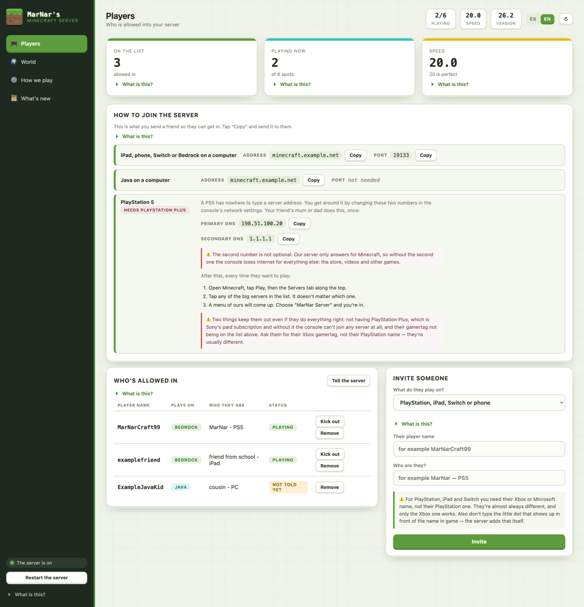
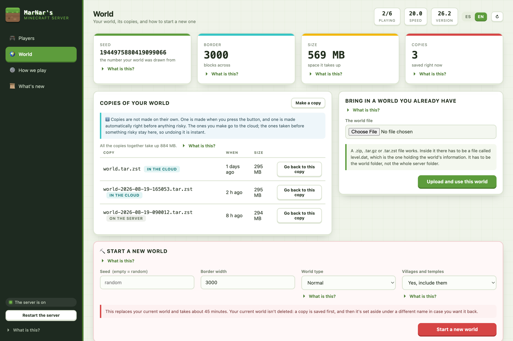
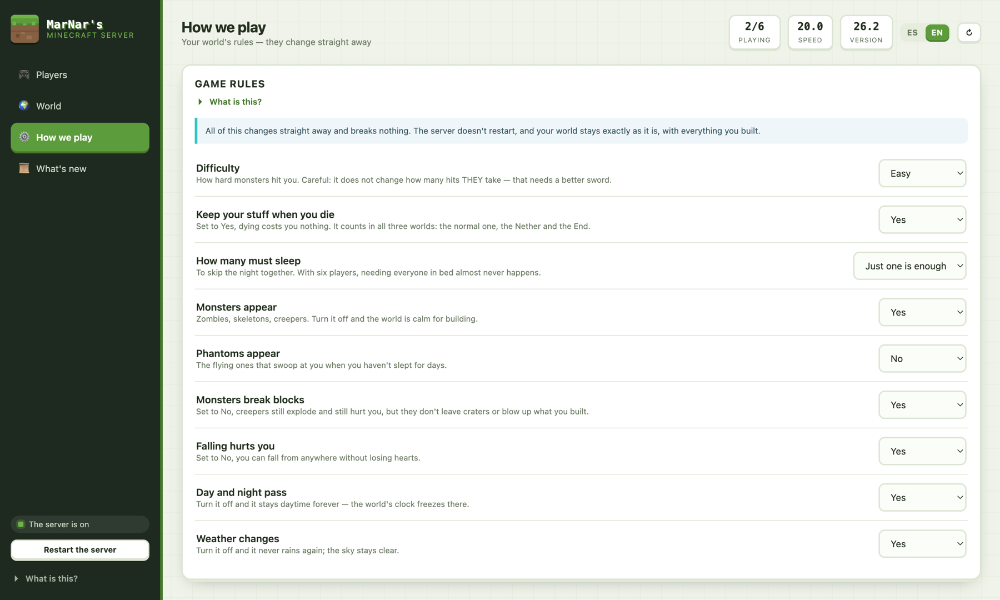
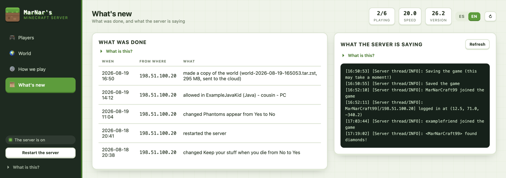

# MarNar Minecraft

**A whole Minecraft server — Java, Bedrock and consoles in one world — plus an admin panel
simple enough that the kid who plays on it can run it.**

Everything here is deployable: the four Docker stacks, the host scripts, the admin panel, and
the runbook that explains what breaks and why. It targets a single small ARM cloud VM
(1 vCPU / 6 GB) and costs about **$0.014 a month** to keep backed up off-site.



---

## What you get

- **One world, every device.** PaperMC (Java Edition) with GeyserMC + Floodgate, so Java on PC,
  Bedrock on phone/tablet/PC, and consoles all land in the same world with the same builds.
- **Consoles that cannot type a server address.** A self-hosted BedrockConnect plus a
  non-recursive DNS redirect puts a PlayStation, Switch or Xbox onto your server by changing two
  numbers in its network settings, once.
- **An admin panel built for a non-technical owner.** Invite and remove players, change how the
  world plays, take and restore backups, import or regenerate the world, watch the console,
  restart the server. Every section carries an expandable *"What is this?"* that teaches the
  concept rather than labelling the button.
- **Two languages, in the panel itself.** Ships in **Spanish and English**, switchable from the
  header with no reload — the screenshots here are the English side. Player-facing setup guides
  are included in Spanish for handing to other parents.
- **Backups you can actually restore.** On-demand copies, an automatic snapshot taken right
  before anything destructive, and a weekly off-site copy to Amazon S3 that only uploads when
  somebody actually played. Restoring is a button in the panel, straight from the bucket.
- **Locked down by default.** The allowlist is commissioned *on and empty* — there is no window
  where the server is reachable and open to anyone. The panel sits behind a reverse-proxy access
  list, and the backup bucket's IAM key can write but **cannot delete**, so a compromised server
  cannot destroy the copies that would rescue it.
- **Documented traps.** The runbook records the failures that cost real time — SIGPIPE in a
  restore guard, hard-linked weekly archives surviving a delete, per-dimension gamerules in
  MC 26.2, an S3 lifecycle rule that silently retains everything forever. Those notes are most
  of the value here.

## The panel

Four views, no build step — a static SPA plus a small Python-stdlib agent on the host.

### Players — who is allowed in, and how they join

The join details are copy-buttons meant to be pasted into a chat: address and port for Bedrock,
address alone for Java, and the two DNS numbers for a console. Adding someone is a name and a
note; the panel resolves the gamertag and tells you exactly what happened.

### World — copies, restore, import, regenerate



Copies are listed wherever they live — in the cloud or on the server — with size and age, and
each one has a *Go back to this copy* button. Starting a new world is the one destructive
button, gated behind typing a confirmation word, and it takes a copy first.

### How we play — live game rules



Difficulty, keeping your items when you die, phantoms, whether one sleeper skips the night, mob
griefing, fall damage, daylight and weather. All of it applies immediately: no restart, and the
world keeps everything that was built in it. That separation is deliberate — everything a player
would want to change is a live setting, so none of it can cost them their builds.

### What's new — audit log and server console



Every privileged action is written down with who did it and when, alongside a tail of what the
server itself is saying.

## What it runs on

| | |
|---|---|
| **Host** | One small VM. Proven on a 1 vCPU / 6 GB ARM cloud VM, `aarch64` |
| **Server** | PaperMC (Java Edition) + GeyserMC + Floodgate, in Docker |
| **Concurrency** | 6 players targeted on a single shared vCPU — raised from 4 after a real four-player session logged no tick lag |
| **Off-site backups** | Any S3-compatible bucket; ~$0.014/month at ~295 MB a copy |
| **TLS / auth** | A reverse proxy (Nginx Proxy Manager here) with an access list; no user database, by decision |

**Why not the official Bedrock server:** it is x86_64-only, and cheap always-free cloud tiers are
usually ARM. Paper + Geyser is what makes an ARM box viable — and it brings Java players along.

## How players connect

| Platform | Address | Port |
|---|---|---|
| **Console (PlayStation / Switch / Xbox)** | set the console's DNS to the server's IP, secondary `1.1.1.1` | — |
| Phone, tablet, Bedrock on PC | your server hostname | **19133** |
| Java Edition on PC | your server hostname | *none needed* |

A console has no field for a server address at all, so it is pointed at the box by DNS and picks
the server out of BedrockConnect's menu. The secondary resolver is **not optional**: the DNS
stack answers only for Minecraft's featured-server names, so without a second resolver the
console loses internet for everything else.

⚠️ Bedrock is on **19133**, not the default 19132. BedrockConnect has to own 19132 because
consoles hard-code it, so Geyser moves one along. Consoles are unaffected — they never type an
address.

> ### ⚠️ PlayStation needs PlayStation Plus — the player's own
>
> Minecraft on PS4/PS5 requires an active PS Plus subscription for online multiplayer,
> third-party servers included. It is Sony's gate and there is no server-side fix. It is a
> **per-player** prerequisite, so the console path is still worth building: anyone whose family
> already has PS Plus can join, and everyone else plays from a phone, tablet or PC.

> ### ⚠️ Adding a brand-new console player can take two tries
>
> GeyserMC's gamertag→XUID lookup only answers for players it has already seen connect, so a
> genuinely new friend cannot always be resolved by name. The route that always works: have them
> try to join once, get turned away, then run the sync — the attempt itself is what makes them
> resolvable. The panel reports which path it took.

## Backups and safety

- **Nothing runs on a timer except the off-site copy.** A copy is made when the button is
  pressed, and automatically just before anything destructive. An off-site copy nobody remembers
  to press is not an off-site copy, so that one is scheduled (weekly) — and it skips the upload
  entirely if nobody played.
- **The disk stages, it does not store.** Archives are removed from the server once S3 confirms
  the size. The only copy that stays local is the automatic pre-destructive snapshot: the undo.
- **The bucket is secret-bearing.** Archives contain the RCON environment file and the Floodgate
  key, so the bucket must stay private. The server's IAM key is denied `s3:DeleteObject` and
  `s3:ListBucketVersions` on purpose; retention lives in an S3 lifecycle rule, not in code that a
  compromised box could run.
- **Restores are proven, not assumed.** `marnar-mc-restore-test` boots a backup without touching
  the live world.

## Repository layout

```
docs/
  REQUIREMENTS.md      ← what was asked for, why, and the decision log
  RUNBOOK.md           ← operating it: health, backups, rollback, known traps
  SETUP-PS5.md         ← player-facing guide (Spanish)
  SETUP-IPAD-Y-PC.md   ← player-facing guide (Spanish)
admin/
  README.md            ← the panel: architecture, deploy, and the traps it cost
  ui/                  ← static SPA + nginx image, no build step
  agent/               ← host agent (Python stdlib), systemd unit, sudoers
  install.sh           ← idempotent deploy
stacks/
  minecraft/           ← Paper + Geyser + Floodgate      TCP 25565, UDP 19133
  bedrock-connect/     ← the menu consoles land in       UDP 19132
  mc-dns/              ← non-recursive DNS redirect      UDP/TCP 53
scripts/
  marnar-mc-adminctl         ← the privileged verbs the admin panel may invoke
  marnar-mc-backup           ← world backup, on demand
  marnar-mc-offsite          ← weekly off-site copy to S3 (systemd timer)
  marnar-mc-s3               ← the only thing that talks to the bucket (put/get/list/stat)
  marnar-mc-restart          ← nightly JVM bounce (systemd timer)
  marnar-mc-restore-test     ← proves a backup boots, without touching the live world
  marnar-mc-sync-players     ← applies the roster to the whitelist
  marnar-mc-dns-ratelimit    ← per-source rate limit on port 53
  raknetping.py / amptest.py / ratetest.py  ← the verifications, kept so they can be re-run
```

Start with **[`docs/REQUIREMENTS.md`](docs/REQUIREMENTS.md)** for what it does and why, and
**[`docs/RUNBOOK.md`](docs/RUNBOOK.md)** for running it. The panel has its own guide in
[`admin/README.md`](admin/README.md).

## Deploying it

The stacks are plain `docker compose`; the panel installs with `admin/install.sh`, which is
idempotent. Hostnames, ports, the S3 bucket and the admin credentials are configuration — the
values in this repository are placeholders, and every host-specific setting is read from
environment files described in the runbook.

Everything under `stacks/*/data/` is gitignored: worlds and generated config live on the server,
and no secrets are committed.

**Player data is deliberately absent.** The roster and the record of who was added or removed
live on the server, not here. This repository describes how to *build* the server; who plays on
it is usage data about children, and does not belong in something whose value is being copyable.

## A note on hosting at home

This was originally planned for a Raspberry Pi on a home connection and moved to a cloud VM
because **nothing inbound from the internet reached it** — CGNAT, double NAT, ISP port blocking
and host firewalling were each ruled out by measurement, and the router silently ignored
port-forwarding rules it displayed as enabled. If you plan to self-host at home, prove an
inbound connection *first*; the diagnostic table is in
[`docs/REQUIREMENTS.md`](docs/REQUIREMENTS.md) §4.2.
